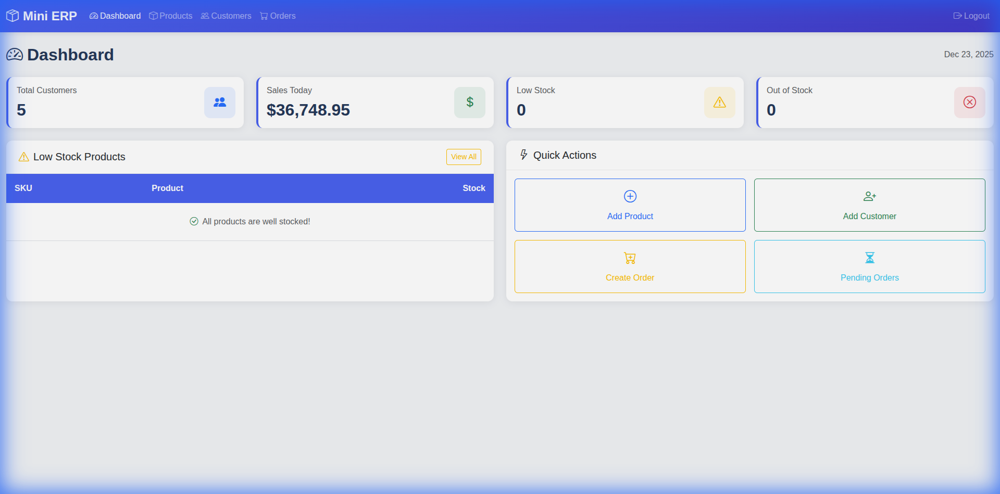
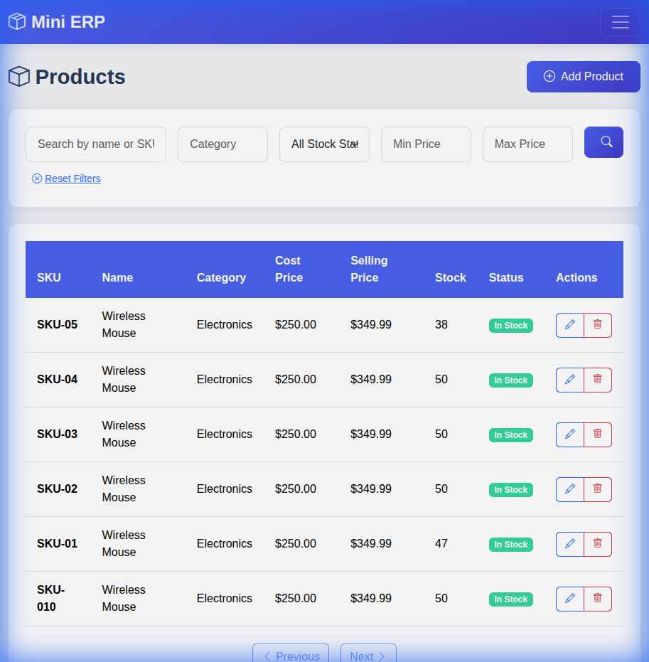

# Mini ERP Frontend

A Bootstrap 5 frontend for the Mini ERP API with full CRUD functionality for Products, Customers, and Orders.

## Features

- 🔐 **JWT Authentication** - Login with auto token refresh
- 📊 **Dashboard** - Real-time stats from API (customers, sales, stock alerts)
- 📦 **Products** - List, create, edit, delete with filters and pagination
- 👥 **Customers** - Full CRUD with pagination
- 🛒 **Orders** - Create orders with dynamic items, view details, update status

## Tech Stack

- **Bootstrap 5.3.2** - UI framework
- **Bootstrap Icons** - Icon library
- **Vanilla JavaScript** - No frameworks, just ES6+
- **Fetch API** - HTTP requests

## Project Structure

```
mini-erp-front-end/
├── index.html           # Entry point (redirects based on auth)
├── login.html           # Login page
├── dashboard.html       # Dashboard with API stats
├── products.html        # Products list
├── product-form.html    # Product create/edit
├── customers.html       # Customers list
├── customer-form.html   # Customer create/edit
├── orders.html          # Orders list
├── order-form.html      # Order create
├── order-details.html   # Order view/status update
├── css/
│   └── style.css        # Custom styles
└── js/
    ├── api.js           # API utilities & token management
    ├── auth.js          # Login/logout
    ├── products.js      # Products module
    ├── customers.js     # Customers module
    └── orders.js        # Orders module
```

## Quick Start

### 1. Start the Backend API
Ensure your Django API is running at `http://localhost:8000`

### 2. Start the Frontend
```bash
cd mini-erp-front-end
python3 -m http.server 3000
```

### 3. Access the App
Open http://localhost:3000 in your browser

## API Configuration

The API base URL is configured in `js/api.js`:

```javascript
const API_BASE_URL = 'http://localhost:8000';
```

## Authentication

- JWT tokens stored in `localStorage`
- Auto token refresh on 401 responses
- Protected routes redirect to login

## Error Handling

Backend validation errors are automatically parsed and displayed:
- Field errors: `Phone: The phone number entered is not valid.`
- General errors displayed in alert notifications

## Screenshots

### Login


### Dashboard


### Products


### Orders


## License

MIT
